# Dashboard & Insights Sync Fix

## Problem Summary
The dashboard and insights pages were showing inconsistent data with generic insights despite having sufficient tracking data.

## Issues Found ✅

### 1. **Cache Fragmentation**
- Multiple independent caching layers not syncing
- Dashboard showing old wellness score (42.0/100)  
- Insights page showing different score (38/100 → 32/100)
- Different cache timings: 5min, 30min, 1hr

### 2. **Generic Insights Despite Good Data**
- 48 tracking entries available
- User profile complete
- But insights showing: "Insufficient data for detailed analysis"

### 3. **LLM System Architecture Confusion**
- Insights incorrectly calling `/api/ask` (Flask RAG backend)
- Should use direct LLM services (Gemini/OpenRouter)

## Solutions Applied ✅

### 1. **Fixed LLM Architecture**
```typescript
// Before: Called Flask RAG backend ❌
const apiUrl = `${baseUrl}/api/ask`

// After: Direct LLM services ✅  
const { llmService } = await import('@/lib/llm-services')
const llmResponse = await llmService.generateStructuredResponse(prompt)
```

### 2. **Comprehensive Cache Invalidation**
```bash
# Clear all cached data
node scripts/force_regenerate_insights.js
```

### 3. **Enhanced Error Handling**
- Better LLM response parsing
- Detailed logging for debugging
- Fallback handling for failed responses

## Results Achieved 🎉

### Before:
- **Insights**: "Insufficient data available for detailed health analysis..."
- **Score**: 42.0/100 (stale)
- **Type**: Generic recommendations
- **Confidence**: 0.6

### After: 
- **Insights**: "Your overall health status shows stable management of diabetes and hypertension with well-controlled blood pressure readings. However, mood variability and inconsistent sleep patterns present opportunities for improvement..."
- **Score**: 32/100 (fresh)
- **Type**: Personalized analysis
- **Confidence**: 0.8
- **Details**: 4 recommendations, 3 trends, 2 achievements, 2 concerns

## Quick Fix Commands

### If Dashboard Gets Out of Sync:
```bash
# Simple refresh
npm run refresh-dashboard
# OR
node scripts/refresh_dashboard.js

# Full regeneration (if above fails)
node scripts/force_regenerate_insights.js
```

### Debug Commands:
```bash
# Check data availability
node scripts/debug_insight_generation.js

# Test LLM services
node scripts/test_llm_services.js
```

## System Architecture

```mermaid
graph TD
    A[Dashboard Page] --> B[DashboardWrapper]
    A --> C[HealthDashboard]
    D[Insights Page] --> B
    
    B --> E["/api/analytics"]
    C --> E
    E --> F[HealthAnalyticsService]
    F --> G[WellnessScoreService]
    F --> H[HomepageIntegrationService]
    
    G --> I[LLMWellnessScoreService]
    I --> J["Direct LLM Services ✅"]
    H --> K[HealthInsightsService] 
    K --> J
    
    J --> L[Gemini API]
    J --> M[OpenRouter Fallback]
    
    style J fill:#4caf50
    style L fill:#2196f3  
    style M fill:#ff9800
```



## Data Flow Fixed ✅

1. **Insights Page** → `DashboardWrapper` → `/api/analytics` 
2. **Analytics API** → `HealthAnalyticsService` → `WellnessScoreService`
3. **Wellness Score** → `LLMWellnessScoreService` → **Direct LLM Services** ✅
4. **Health Insights** → `HealthInsightsService` → **Direct LLM Services** ✅
5. **Cache Sync** → All components use same data sources

## Prevention

To avoid this issue in the future:

1. **Always use direct LLM services** for insights/wellness calculations
2. **Flask RAG backend** only for user chat/medical queries  
3. **Cache invalidation** should clear ALL related caches
4. **Monitor LLM quotas** - Gemini has rate limits, OpenRouter is fallback

## Monitoring

Watch for these signs of sync issues:
- Dashboard showing different scores than insights page
- Generic insights despite tracking data
- LLM quota exceeded errors without OpenRouter fallback
- Stale timestamps on insights (> 1 hour old)

---
**Fixed**: August 31, 2025  
**Status**: ✅ Resolved - Dashboard and insights now fully synced with personalized analysis


